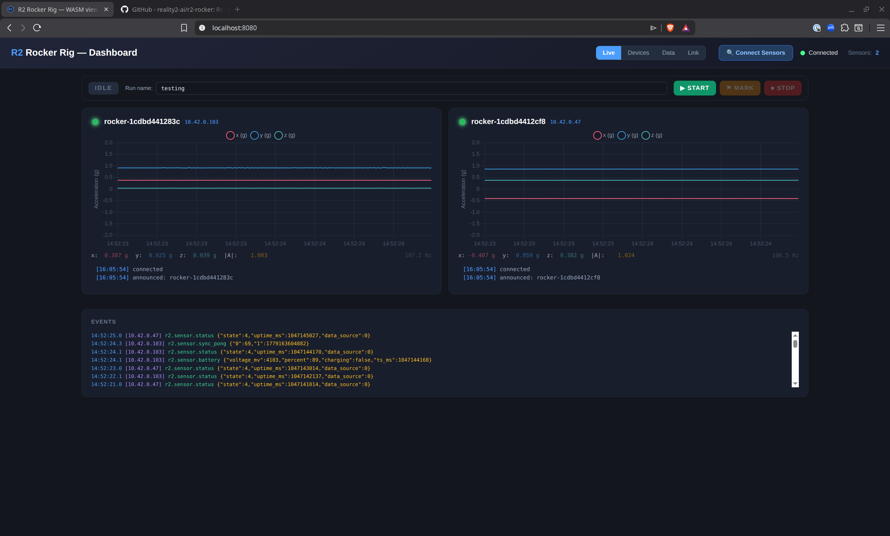
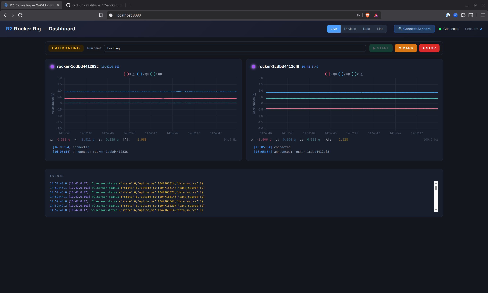
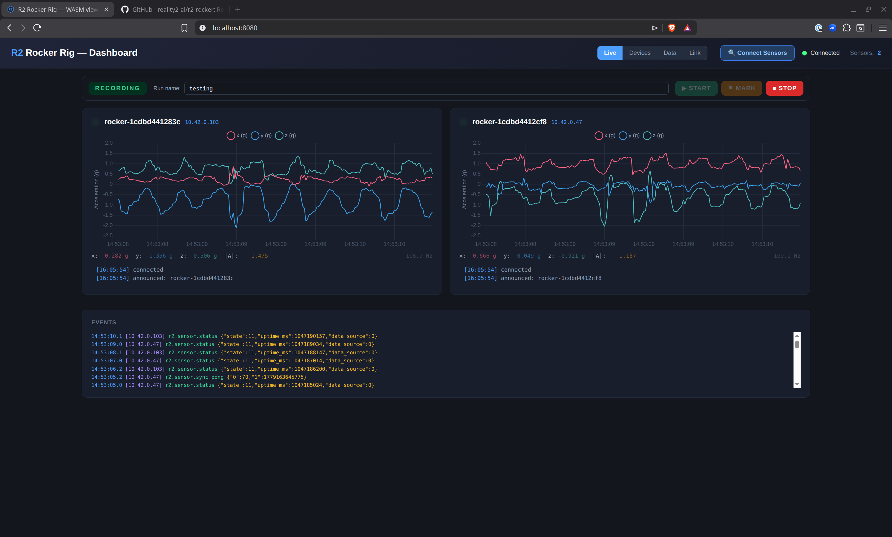
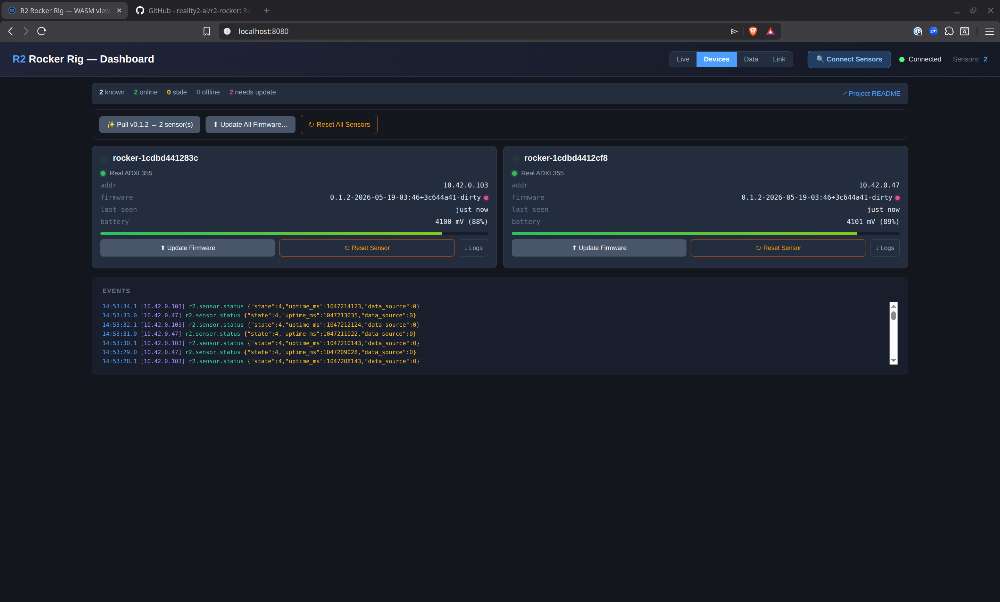
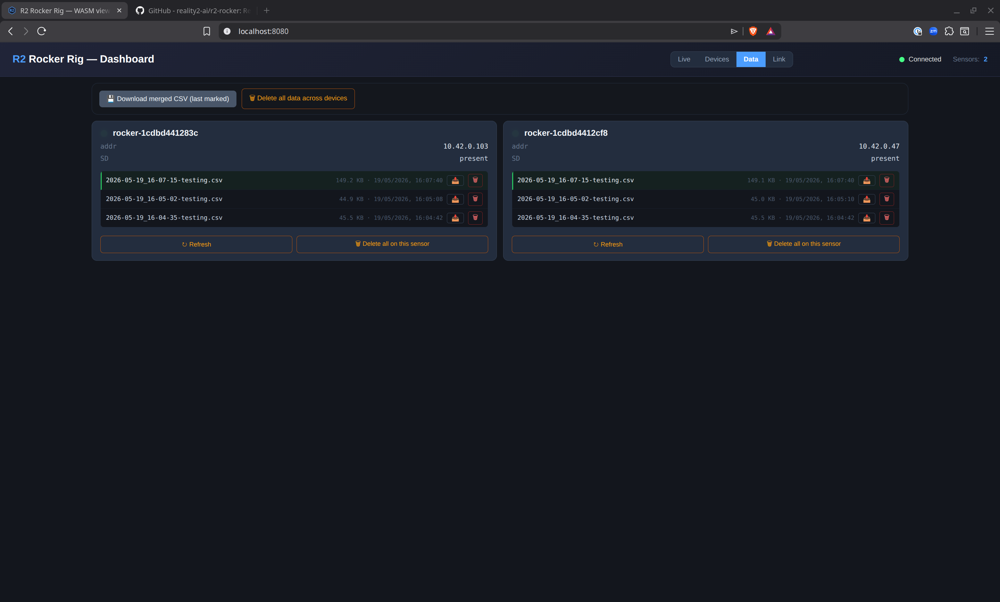
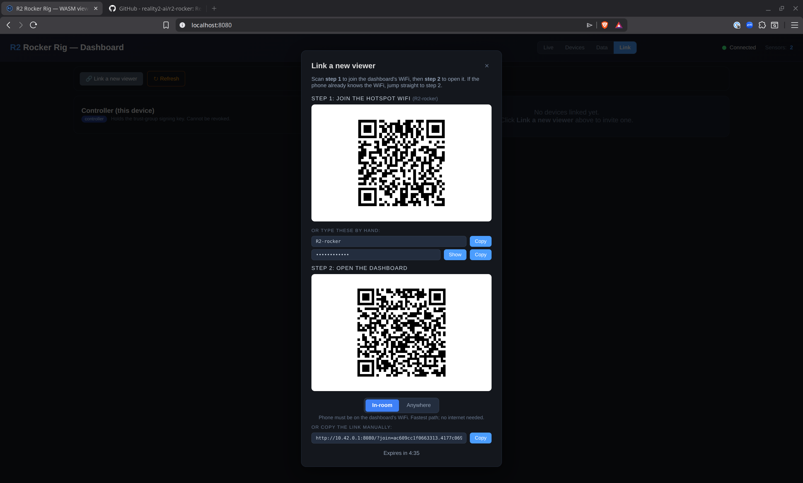

<p align="center"></p>

# r2-workshop

A wireless sensor mesh for workshop and lab environments —
vibration, temperature, pressure, strain. Edge intelligence
detects anomalies and alerts before something breaks.

> **Renamed from r2-rocker (2026-05-24).** The first deployment
> was a tyre-wear test rig at the University of Auckland (see
> §"First deployment" below). The project name and framing have
> been generalised so the same mesh can serve other workshop /
> lab instrumentation jobs. The architecture, R2-protocol
> conformance, and binding decisions are unchanged.
>
> **If you used r2-rocker before the r2-workshop rename:**
> * Move your TG private key:
>   `mv ~/.config/r2-rocker ~/.config/r2-workshop`
> * Reflash any sensors carrying pre-rename firmware — the
>   R2-BEACON class string changed
>   (`nz.ac.auckland.rocker.sensor` → `nz.ac.auckland.workshop.sensor`,
>   FNV `0x6A3B0860` → `0xE6C6AFCD`).
> * The archived original repo at
>   [reality2-ai/r2-rocker](https://github.com/reality2-ai/r2-rocker)
>   has the full v0.1–v0.2 history if you need it.
>
> **If you used r2-workshop pre-ensemble (before 2026-05-28):**
> The class string rotated again, this time to align with
> the canonical R2-ENSEMBLE namespace policy — r2-workshop is
> the *template*, the rocker rig is the *deployment*:
> * `nz.ac.auckland.workshop.sensor` → `nz.ac.auckland.rocker`
> * FNV `0xE6C6AFCD` → `0x624C47BC`
> * Reflash every sensor (the FNV event-hash table changes; old
>   firmware can't talk to the new dashboard).
> See SPEC-R2-WORKSHOP-ENSEMBLE §2.1 + §2.3 for the policy.



## First deployment

The driving deployment is a **tyre-wear test rig** at the
University of Auckland — instrumenting the rig's load-bearing
joints, actuators, and bearings to detect incipient mechanical
failure before it becomes obvious. The longer arc ends with a
classifier warning the operator before joint failure; v0.1+v0.2
are the data-collection phase of that arc (see
[`conversation/THEMES.md`](conversation/THEMES.md) §12).

The hardware is deliberately general — the sensors clip on, you
point them at whatever you're measuring, and the dashboard records,
displays, and exports. Three carrier boards are supported as of
v0.3.0:

* **ESP32-S3-DevKitC-1** + ADXL355 accelerometer + microSD + LiPo —
  the reference / current default (ADR-002).
* **Seeed XIAO ESP32-S3** — smaller alternative S3 carrier (ADR-001).
* **DFRobot Beetle ESP32-C6 (DFR1117)** — alternative **RISC-V**
  carrier with a `lis2dh` I²C sensing plugin (ADR-003, v0.3.0).

The R2-protocol stack is shared across all three. Other sensor types
(temperature, pressure, strain) ride the same wire format with
heterogeneous-fleet routing on the dashboard side (Phase 10).

## Reading order

If you're new and want to understand the whole thing:

1. This README.
2. [`PROCESS.md`](PROCESS.md) — five rules for how we work on this project.
3. [`plan/PLAN.md`](plan/PLAN.md) — what we're building, in what order, and why.
4. [`specifications/HARDWARE-WIRING.md`](specifications/HARDWARE-WIRING.md) — physical sensor build (pinouts, photos).
5. [`specifications/SECRETS-POLICY.md`](specifications/SECRETS-POLICY.md) — before you touch any keys.
6. The latest entry in [`conversation/`](conversation/) — the most recent thinking, in raw form.

For AI assistants helping with the project: read
[`AI-CONTEXT.md`](AI-CONTEXT.md) first; it's a curated entry point.

The full normative specs are under [`specifications/`](specifications/):

- `SPEC-R2-WORKSHOP-SYSTEM.md` — the system as a whole.
- `SPEC-R2-WORKSHOP-WIRE.md` — the message format on the wire.
- `SPEC-R2-WORKSHOP-SENSOR.md` — what the sensor firmware does.
- `SPEC-R2-WORKSHOP-SENTANTS.md` — the **sentant + plugin catalog**
  that makes up the sensor firmware (one row per building block,
  with the events it consumes / produces). The intended workflow
  is to compose the firmware from these descriptions — re-use a
  sentant in another ESP32 sensor build by porting the file and
  declaring its plugin dependencies.
- `SPEC-R2-WORKSHOP-DASHBOARD.md` — what the controller does.
- `SPEC-R2-WORKSHOP-TIMESYNC.md` — the time-sync hybrid model.
- `SPEC-R2-WORKSHOP-SENSOR-HEALTH.md`,
  `SPEC-R2-WORKSHOP-SENSOR-REMOTE-RESET.md`,
  `SPEC-R2-WORKSHOP-SENSOR-LIVE-LOGS.md` — sensor-side feature specs.
- `SPEC-R2-WORKSHOP-BRIDGE.md` — how the production and viewing trust
  groups talk to each other.
- `HARDWARE-WIRING.md`, `SECRETS-POLICY.md` — operational specs.

## What it does

Small battery-powered sensors clip onto the points you want to
watch on a machine — a joint, an actuator bolt, a bearing housing
— and stream their accelerometer readings live to a laptop on the
lab bench. The laptop records the data, runs a dashboard that
shows the relative motion between sensors in real time, and keeps
every sample on durable SD storage for offline analysis. Comparing
how two joints move (or fail to move together) is what surfaces
shear, fatigue, drift, or other failure modes that don't show up
as a single-point measurement. The hardware is open, the protocol
stack is open, and the whole thing is designed to be handed off to
a university group who can run, modify, or extend it without
depending on any third-party service.

The first deployment is a two-sensor setup on a hydraulic
tyre-wear test rig at the University of Auckland, watching for
sideways joint motion in the rocker arm that drives a rubber
sample across an asphalt sample — which is where the original
`r2-rocker` codename came from. But the system itself is sensor-
agnostic and machine-agnostic: any ESP32-attachable sensor
(accelerometer, strain gauge, temperature, microphone, current
sense, magnetometer, …) and any rigid machinery within WiFi range
of the controller fits the same template. Swap the ADXL355 driver
in the firmware for your sensor of choice, adjust the wire schema,
and the rest of the stack — hotspot, dashboard, web app, OTA, SD
ring, time-sync, log fan-out — applies unchanged.

The protocol stack underneath is **Reality2 (R2)** — an open
messaging substrate for systems built from cooperating *digital
agents* ("sentants" in R2 vocabulary; a sentant is a small piece
of code that handles one kind of event, like a microservice
scoped to a single device). See [reality2.ai](https://www.reality2.ai)
for the wider project that r2-workshop is built on; the R2 specs and
reference crates this repo vendors live under
[`crates/`](crates/) and [`specifications/`](specifications/).

## What you'll find in the box

This project has three kinds of device:

| | What it is | What it does |
|---|---|---|
| **Sensors** | Small ESP32-based boards (microcontroller + accelerometer + battery + SD card) | Sit on the rig at each joint. Sample motion ~100 times a second. Send the readings to the controller over WiFi. |
| **A controller** | Any Linux machine — your laptop, or a Raspberry Pi | Hosts a private WiFi hotspot the sensors join. Receives sensor data over that WiFi. Serves a web app you use to monitor and control the rig. Stores data locally. |
| **Viewers** | Any device with a web browser — laptop, tablet, phone | Show live data. From a few metres away (over the controller's hotspot) or from anywhere on the internet (over a relay). The controller chooses what each viewer is allowed to see and do. |

You always need at least one sensor and one controller. Viewers are
optional — the controller's own browser counts as a viewer.

## How it fits together

```
                ┌──────────────────────────┐
                │  Operator's browser      │   The web app: see live
                │  (laptop / phone /       │   data, manage devices,
                │   tablet)                │   push firmware updates.
                └──────────▲───────────────┘
                           │ encrypted
                           │
                ┌──────────┴───────────┐         ┌────────────────────┐
                │  Controller          │  HTTPS  │  GitHub repo +     │
                │  (on the rig floor)  ├────────►│  Releases          │
                │  · Hosts WiFi        │ (poll)  │  (latest .bin)     │
                │  · Holds the keys    │         └────────────────────┘
                │  · Stores the data   │         Optional — only needed
                │  · Caches GitHub     │         to surface "new
                │    firmware locally  │         firmware available"
                └──────────▲───────────┘         and pull binaries.
                           │ WiFi (controller's hotspot)
                           │
                      ┌────┴────┐
                      │ Sensors │   Small boards on the rig joints.
                      └─────────┘
```

Things this implies that may surprise you if you've used a "normal"
cloud-app:

- **There's no central web server in the cloud holding your data.**
  Data lives on each sensor's SD card, plus the controller's local
  archive. If you want long-term offsite storage you can set it up,
  but it's optional and you own it. Nothing leaves the lab unless you
  decide it does.
- **Security is part of the protocol, not bolted on.** Sensors and
  the controller hold cryptographic keys; everything they send is
  signed and encrypted. A device that doesn't hold the right keys
  can't decode anything passing through, even if it's plugged into
  the same network.
- **The web app doesn't live on a server.** It loads as a small
  bundle of files into your browser, and once loaded it talks
  directly to the controller (or, for remote viewers, through a
  relay that just forwards sealed envelopes — it can't read them).
  This means the same app works onsite (no internet needed) and
  remotely (over the internet) without any change.
- **Browsers join temporarily.** When you want to view data on a new
  device, the operator presses a button on the dashboard which makes
  a QR code (or shareable link). Scanning it pairs that browser. No
  accounts, no passwords. The pairing can be revoked any time.
- **Closed-network deployments work without any internet.** A
  controller laptop, two sensors, and a tablet on the controller's
  hotspot are a complete instrument. No cloud, no GitHub, no
  third-party service. The GitHub link shown on the right of the
  diagram above is *only* used by the dashboard to surface "new
  firmware available" and pull binaries on demand; when the
  controller is offline it falls back to firmware in
  `firmware/<soc-family>/<carrier>/releases/` on its local disk
  (e.g. `firmware/esp32-s3/devkitc/releases/`,
  `firmware/esp32-c6/dfr1117/releases/`) and the rig keeps running.

## What it looks like

The operator-facing surface is a single web page served by the
controller. Four tabs cover everything routine:

**Live** — real-time accelerometer charts, one card per sensor.
The run-control toolbar sits at the top: a state chip
(`IDLE` / `CALIBRATING` / `RECORDING`), a free-form **Run name**
field, and the **Start → Mark → Stop** buttons. The run name is
what each capture file is named after; the date prefix is added
automatically. Each sensor card shows a small status LED beside its
name that mirrors the physical RGB LED on the board in colour and
rhythm — every dot on the page and every LED on the rig pulse from
the same wall clock, so the rig reads as one synchronised system at
a glance:


**Run control flow.** Pressing **Start** sends a sync-pulse round
to every sensor and puts the fleet into calibration. Sensors
sample for ~2 seconds at rest to learn their per-axis offset; the
state chip turns amber and each sensor's LED goes solid purple:



Then **Mark** locks the offset, opens the named CSV file on every
sensor's SD card, and starts writing calibrated rows. The Live
chart now shows the offset-subtracted signal — exactly what's
landing on disk — and the sensor LEDs switch to a crisp green
tick at 2 Hz so the operator can see at a glance that the file
is actually growing, not just that the link is alive. Start is
disabled until the session ends:



**Devices** — fleet status. Real-vs-simulated ADXL355, firmware
version, last-seen, battery cell voltage. Per-card *Update Firmware*
and *Reset Sensor* buttons; their fleet-wide equivalents sit in the
toolbar above (one confirm, not one per sensor). If the controller
sees a newer build on GitHub Releases than what's running, an
`✨ Pull <ver> → N sensor(s)` button appears that pulls the binary
once and pushes it to every outdated peer:



**Data** — every capture file from every sensor, sorted newest
first. Per-file download (📥), per-file delete (🗑), per-sensor
delete-all, plus the fleet-wide **Download merged CSV** that
produces a single wide-format file with one column-triple per
sensor (see `SPEC-R2-WORKSHOP-CAPTURE` §7.3). The file that the
merged-CSV button bundles — the most-recently-marked capture across
every sensor — is highlighted in green so the operator can see at a
glance which rows go together:



**Link** — pairing for extra viewer browsers. The controller's own
browser counts as a viewer automatically (the dashboard trusts
localhost as the KeyHolder); to add a phone, tablet, or another
laptop, click **Link a new viewer** for an invite modal with two QR
codes — step 1 joins the device to the controller's WiFi hotspot,
step 2 opens the dashboard. An **In-room ↔ Anywhere** toggle below
the dashboard QR swaps it for a relay-routed URL when the viewer
needs to connect from outside the lab (cellular, home WiFi, …).
Invites are time-limited and KeyHolder-only; viewers see a
read-only subset of the controller's surface:



---

## Reference hardware

The full carrier index — including the two S3 alternatives and the
DFR1117 / ESP32-C6 — lives in
[`specifications/HARDWARE-WIRING.md`](specifications/HARDWARE-WIRING.md).
The list below is the **reference DevKitC build** (ADR-002). Adjust
per the wiring document of your chosen carrier.

You need:

- **One ESP32-S3-DevKitC-1-N8R8** development board per sensor.
  (Available from most electronics distributors. ~NZD 50.)
- **One ADXL355-PMDZ** accelerometer module per sensor. (Analog
  Devices' evaluation board for the ADXL355 chip. ~NZD 100.)
- **One microSD card breakout + microSD card** per sensor (any
  capacity ≥ 4 GB). For local data buffering.
- **One single-cell LiPo battery** per sensor (3.7 V, 1–2 Ah, JST-PH
  connector). Removable for off-rig charging.
- **One 3.3 V buck-boost regulator module** per sensor (Pololu
  S7V8F3 or equivalent). Sits between the LiPo and the DevKitC's
  3V3 rail so the chip sees a stable 3.3 V across the cell's full
  3.0–4.2 V discharge curve — without it, both ends of the curve
  cause flaky behaviour (chip resets near empty, SD/ADXL355
  marginal at peak).
- **One Linux laptop or Raspberry Pi** as the controller, with
  **two WiFi adapters**: one for the lab's usual internet, one
  dedicated to hosting the sensor hotspot. Strongly recommended,
  not optional — the controller's bootstrap engine refuses to host
  a hotspot on the internet-carrying adapter (it would knock the
  controller off the lab network), so a single-WiFi machine can't
  do both jobs at once. A cheap USB WiFi dongle alongside the
  built-in radio is plenty. Wired ethernet for the internet side
  also frees up the built-in WiFi for the hotspot.
- **Female-to-female DuPont jumper wires** (about 6 per sensor, for
  the Pmod-to-DevKitC connection).
- **Two 100 kΩ resistors** + **one 100 nF ceramic cap** per sensor —
  for the battery-sense voltage divider (see
  `specifications/HARDWARE-WIRING-DEVKITC.md` §4.2). The cap is the
  important one: without it the ADC can't sample the high-impedance
  divider correctly and the firmware falls back to a simulated
  battery feed.

The full wiring is in [`specifications/HARDWARE-WIRING.md`](specifications/HARDWARE-WIRING.md).

## Setting it up the first time

You only do this once per fresh checkout.

```bash
# 1. Get the source.
git clone https://github.com/reality2-ai/r2-workshop
cd r2-workshop

# 2. Install the Rust embedded toolchain (one-time, ~5 minutes).
#    Espressif's installer for the Xtensa toolchain the firmware needs.
cargo install espup
espup install
# Source the toolchain into your shell. Add to your ~/.bashrc /
# ~/.zshrc to do this automatically on future shells:
source ~/export-esp.sh

# 3. One-time firmware build setup.
./tools/setup-firmware.sh

# 4. Generate the cryptographic keys for THIS deployment. Run ONCE
#    per rig — your lab gets its own Trust Group. One command, no
#    flags; defaults to:
#      trust_keys/tg_pub.bin                      (committed, baked into firmware)
#      trust_keys/tg_cert.bin                     (committed, self-signed)
#      ~/.config/r2-workshop/tg_signer/tg_priv.bin  (off-tree; dashboard reads)
cargo run -p r2-workshop-tg --release -- init
```

> **Why step 4 matters:** the firmware embeds `trust_keys/tg_pub.bin`
> via `include_bytes!` at compile time, so two deployments cannot
> share keys unless they trust the same KeyHolder to sign each
> other's sensors. The `build-firmware.sh` script refuses to build
> if the keys are missing or still on the upstream demo key. If
> you're not the original developer and you're seeing a "no Trust
> Group keys" error from the build script, that's the prompt to
> run step 4.

## Day-to-day operation

After the first-time setup, normal use is:

```bash
# 1. Bring up the lab WiFi hotspot the sensors will join.
#    --rotate generates fresh credentials; without it, the previous
#    credentials are reused.
./tools/setup-hotspot.sh

# 2. Build the firmware for your carrier — devkitc, xiao, or dfr1117
#    (defaults to devkitc). The script is carrier-aware: devkitc/xiao
#    build for ESP32-S3 (xtensa), dfr1117 for ESP32-C6 (RISC-V).
#    Produces two files: one for cabled flashing, one archived under
#    firmware/<soc-family>/<carrier>/releases/ for posterity.
./tools/build-firmware.sh devkitc

# 3. Flash a fresh sensor over USB. The DevKitC's USB-OTG port shows
#    up as /dev/ttyACM0 on Linux. Only needed once per chip — after
#    that, updates push wirelessly.
cd firmware/esp32-s3/devkitc && source ~/export-esp.sh
cargo espflash flash --release --port /dev/ttyACM0
cd ../../..

# 4. Start the dashboard. Prints a banner with version + ports.
#    The dashboard also serves the web app from `webapp/` at the
#    root of the same HTTP port — no separate webapp server needed.
cargo run --release -p r2-dashboard

# 5. Open http://localhost:21042/ in your browser.
# 6. Click "Connect Sensors" and watch the LEDs.
```

The sensor's small RGB LED tells you what it's doing at a glance.
All sensors run their animations off the synchronised wall clock,
so heartbeats and ticks across the rig pulse in lockstep — useful
visual confirmation that the fleet is one system:

| LED | Meaning |
|---|---|
| Quick white flash | Just powered on. |
| Pulsing blue (~1 Hz) | Advertising over Bluetooth — looking for a controller, no WiFi credentials yet, or WiFi has been gone long enough that we've dropped back to pairing mode. |
| Pulsing cyan (fast, ~2.5 Hz) | Joining WiFi, or briefly reaching for the dashboard after a TCP hiccup. |
| Slow green heartbeat (~25 BPM, 2.4 s/cycle) | Connected, streaming, idle — link alive, no capture in progress. |
| Crisp green tick (~2 Hz) | Recording — a capture file is open on the SD card and rows are landing. Distinct rhythm from the idle heartbeat so you can see at a glance that data is actually being written. |
| Solid purple | Calibrating — accumulating per-axis offset samples while the rig is at rest, before Mark. |
| Slow purple pulse (~0.5 Hz) | Streaming with synthetic data — ADXL355 didn't come up; samples are simulator output, not real motion. Look at the sensor's logs. |
| Yellow heartbeat | Streaming + replaying catchup samples from the SD ring after a reconnect. |
| Strobing white | Receiving a firmware update. |
| Pulsing orange | Battery low. |
| Pulsing red | Something went wrong; reset and try again. |

The dashboard's web app shows a virtual copy of each sensor's LED
next to the device's name, in the same colour and rhythm, so you
can see the same status from across the room without looking at
the rig.

## Updating firmware wirelessly

Once a sensor has been flashed once over USB, you don't need the
cable again:

```bash
./tools/build-firmware.sh devkitc        # produces a new .bin
```

In the dashboard, switch to the **Devices** tab, click *Update
Firmware* on the sensor's card, and pick the new `.bin` file
(`firmware/<soc-family>/<carrier>/target/<rust-target>/release/r2-workshop-firmware.bin`).
The sensor receives the image, checks its integrity, writes the
inactive partition, reboots into the new firmware, and rejoins.
Takes about 15 seconds.

To update every sensor at once, click **Update All Firmware…** at
the top of the Devices view and pick a `.bin`. Since v0.3.0 the
puller is **carrier-aware**: it parses the carrier slug out of the
filename (the spec convention
`r2-workshop-firmware-<class>-<carrier>-<version>.bin`) and pushes
the image only to sensors whose announced `carrier` matches —
refusing to send a wrong-arch image to a different-carrier sensor.
Sensors already running that build (matched by `fw_ver`) are
skipped, as are sensors on pre-v0.3 firmware that don't yet announce
a `carrier` (use the per-sensor button for those). The companion
**Update Outdated from Latest** button (which pulls from a GitHub
Release rather than a local file) does the same per-carrier grouping
automatically.

The **Reset All Sensors** button does a fleet-wide reboot fan-out.

If the new firmware is broken — can't join WiFi, or can't reach the
dashboard — the bootloader notices on the next boot and rolls back
to the previous version automatically. So you can't accidentally
brick a sensor over the air.

Every wireless-update build is also archived under
`firmware/<soc-family>/<carrier>/releases/` with the version string
in the filename, so you can always find the exact bytes a given
sensor is running.

## Building a new firmware version by hand

`tools/build-firmware.sh` wraps three steps. If you'd rather run
them yourself (or are debugging the build):

```bash
# Step 1: source the ESP toolchain into the current shell.
source ~/export-esp.sh

# Step 2: compile. The carrier subdirectory you `cd` into is what
#         picks devkitc vs xiao pin maps; the firmware crate is the
#         same code, parameterised by a per-carrier Cargo manifest.
cd firmware/esp32-s3/devkitc
cargo build --release

# Step 3: convert the ELF into an ESP image (the .bin format the
#         OTA flow understands). `espflash flash` does this
#         internally; `espflash save-image` just writes the
#         conversion out to disk without flashing.
espflash save-image --chip esp32s3 \
    target/xtensa-esp32s3-espidf/release/r2-workshop-firmware \
    target/xtensa-esp32s3-espidf/release/r2-workshop-firmware.bin
```

The resulting `target/xtensa-esp32s3-espidf/release/r2-workshop-firmware.bin`
is what `/api/ota/{addr}` accepts. The release archive copy under
`releases/` is purely for posterity — the build script copies it
there but it's not on the OTA path.

The `fw_ver` string the firmware reports in its announce (and that
the dashboard's device card shows) is stamped by the firmware's
`build.rs` from `git rev-parse HEAD` + `date -u`. Edit any source
file, commit, or modify the index and `build.rs` re-runs on the
next `cargo build` so the stamp tracks the actual binary. The
"App version" line in the ESP-IDF boot banner is **separate** — it
comes from a CMake-generated source file that only refreshes on a
full IDF reconfigure (i.e. after `cargo clean`). Use the announce
string in the dashboard, not the boot banner, as the source of
truth for what's running.

## Rebuilding the web app from source

The web app at `webapp/` is plain HTML + JS, plus a `pkg/`
sub-directory containing a WebAssembly bundle compiled from
`crates/r2-wasm`. The dashboard binary serves `webapp/` over HTTP
(port 8080) — nothing in this directory is bundled into a separate
build artefact, so an `index.html` edit is live on the next page
reload (the service worker caches assets; bump `CACHE` in
`webapp/sw.js` to force-refresh every connected browser).

To rebuild the WebAssembly bundle (only needed when `crates/r2-wasm`
or any of its R2-stack dependencies change):

```bash
# One-time: install wasm-pack if you don't have it.
cargo install wasm-pack

# Rebuild webapp/pkg/ from crates/r2-wasm/.
wasm-pack build crates/r2-wasm --target web --release \
    --out-dir ../../webapp/pkg
```

Output lands at `webapp/pkg/`. The HTML in `webapp/index.html`
imports `./pkg/r2_wasm.js`. There is no separate dev server — open
the dashboard's unified R2 port (`http://localhost:21042/`) and you
have the freshly-rebuilt viewer. Hard-refresh the browser (or bump
the service worker cache key) if a stale cached version sticks.

## Under the hood

The architecture diagram earlier is the **operator's** view —
boxes for sensors / controller / browser, arrows for "data flows
here." This section drops one level lower for someone reading the
code: where in the firmware does each piece live, how do the
threads talk, what hits the network in what shape.

### End-to-end data path

Since v0.2.0 the dashboard listens on a **single port** — `21042`,
the canonical R2-WIRE events port per `r2-specifications/specs/r2-core/
R2-WIRE.md` §13.5 — and dispatches each accepted connection by
peeking the first byte: zero high-byte of a u16 length prefix →
raw sensor TCP; ASCII uppercase letter → HTTP/WebSocket. The same
port serves browsers and sensors without collision.

```
  ADXL355
    │  SPI @ 5 MHz
    ▼
  firmware sender thread ──── on every sample (100 Hz) ───────┐
    │                                                          │
    │  R2-WIRE frame                                           │  Ring::append
    │  (12-byte header + CBOR payload)                         ▼
    │                                              /sdcard/logNNNN.csv
    ▼                                              (durable backstop,
  TCP 21042 (raw)                                  ACK-driven freeing)
    │
    ▼
  dashboard accept-loop  ──── peek first byte ────► route
                          │
                          ├── 0x00 → handle_sensor_connection
                          │                │
                          │                ├──► state.peers (per-peer tx)
                          │                │
                          │                └──► raw_frame_tx ─► /r2
                          │                                  ▲ (10:1 decimated
                          │                                  │  for acceleration)
                          │
                          └── 'G'/'P'/… → hyper + axum
                                          │
                                          ├──► / (static webapp)
                                          ├──► WS /r2  ── R2-WIRE,
                                          │              bi-directional:
                                          │              sensor frames out,
                                          │              r2.dash.cmd.* in
                                          ├──► WS /ws/logs/{addr} (text)
                                          └──► /api/{ota,firmware,data,...}
                                                (plugin transports —
                                                 not R2 events)
                                                       │
                                                       ▼
                                                browser tab
                                                  R2WorkshopHive
                                                  + DashboardViewerSentant
                                                       │
                                                       ├─► Chart.js charts
                                                       ├─► Devices card grid
                                                       └─► capture state →
                                                           Start/Mark/Stop UI
                                                            (each click →
                                                             r2.dash.cmd.* on /r2)
```

Why each hop exists:
* **SPI → sender thread** keeps the SPI bus off the main thread so
  BLE bootstrap can keep listening for re-provisioning offers even
  while WiFi is up.
* **Sender → SD ring first** is the durability guarantee — every
  sample lands on the card *before* it goes out on the wire, so a
  network blip doesn't lose data. The dashboard's `r2.dash.ack`
  back-channel frees old SD segments as records are acknowledged.
* **Single port 21042 + peek-based dispatch** unifies what used to
  be two separate listeners (sensor TCP + browser HTTP on different
  ports). R2-WIRE §13.5 says both raw-TCP R2-WIRE and WebSocket
  R2-WIRE belong on the same canonical port; the peek selects per-
  connection without affecting framing.
* **/r2 carries every R2-WIRE event in both directions**: sensor-
  emitted events forwarded outbound to viewers; viewer-emitted
  operator commands (`r2.dash.cmd.capture.{start,mark,stop}`,
  `cmd.reset`, `cmd.identify`, `cmd.bootstrap`, `cmd.device.alias.set`,
  `cmd.access.*`) inbound. The legacy `/ws/status` text-JSON channel
  + ~14 `/api/*` operator routes that existed pre-v0.2 are gone.
* **Acceleration is decimated 10:1** before `raw_frame_tx` broadcast
  so the live wire stays around 10 Hz / sensor — the SD ring keeps
  the full 100 Hz fidelity. Pi5 deployments depend on this.
* **Per-sensor /ws/logs** opens an on-demand `nc`-equivalent to the
  sensor's `log_tcp` listener — used by the "Logs" toggle on each
  device card. Non-R2-WIRE plugin transport.

### Capture state machine (SPEC-R2-WORKSHOP-CAPTURE)

The Live tab's Start → Mark → Stop buttons drive this FSM on every
connected sensor in parallel:

```
                  r2.dash.capture.start
            ┌────────────────────────────────┐
            │       (any state → restart)    │
            ▼                                │
        ┌────────┐                    ┌──────┴───────┐
        │  Idle  │                    │  Calibrating │
        │        │                    │   2 s window │
        │ LED    │                    │   accumulate │
        │ green  │                    │   mean off.  │
        │ heart- │                    │   LED purple │
        │ beat   │                    └──────┬───────┘
        └────────┘                           │
            ▲                                │ r2.dash.capture.mark
            │                                │ (validates name + prefix,
            │                                │  opens capture CSV,
            │                                │  locks offset)
            │                                ▼
            │                          ┌──────────────┐
            │                          │  Recording   │
            └──────────────────────────┤              │
              r2.dash.capture.stop     │  write each  │
              (always → Idle,          │  sample as   │
               closes file if any)     │  raw − off   │
                                       │  LED green   │
                                       └──────────────┘
```

The `capture.state` event fires on every transition so the webapp
can mirror the FSM state in the run-control panel (IDLE / CALIBRATING
/ RECORDING with colour-matched indicator).

### TCP port map (per sensor)

The sensor exposes four listeners, each with its own purpose:

| Port  | Purpose | Spec |
|-------|---|---|
| 21042 | Events — canonical R2-WIRE TCP transport (samples, status, time-sync) | `SPEC-R2-WORKSHOP-WIRE` |
| 21043 | OTA — receives a `.bin` push from `/api/ota/{addr}` | `SPEC-R2-WORKSHOP-SENSOR` §12 |
| 21046 | log_tcp — telnet-style fan-out of `log!()` output for `nc <ip> 21046` | `SPEC-R2-WORKSHOP-SENSOR-LIVE-LOGS` |
| 21047 | data_tcp — LIST/GET/DEL/DEL_ALL of capture files on the SD card | `SPEC-R2-WORKSHOP-CAPTURE` §6 |

The dashboard reaches each port through a matching HTTP route
(`/api/ota/{addr}`, `/ws/logs/{addr}`, `/api/data/{addr}/*`).
Browsers never connect to sensor ports directly.

### SD card layout

Both the rolling ring and the named captures live on the same
FAT32 partition, side-by-side:

```
/sdcard/
├─ logNNNN.csv               ← rolling ring (durable backstop,
├─ logNNNN.csv                   rotates per SPEC-R2-WORKSHOP-SENSOR §6,
├─ …                             ACK-driven free)
│
└─ captures/
   ├─ 2026-05-18_18-05-06-test.csv     ← operator-driven, named
   ├─ 2026-05-18_18-19-55-test.csv         (Start → Mark → Stop
   └─ …                                     produces one of these)
```

Same row format on both (62-byte fixed-width
`seq, ts_ms, x, y, z`) — captures just carry calibrated values
instead of raw. The dashboard's single-sensor download prepends
a CSV header on the wire (`seq,ts_ms,x,y,z\n`) so the on-disk
file stays compact and the spreadsheet view is self-describing.

---

## Where to look when something doesn't work

| Symptom | First place to look |
|---|---|
| LED stays dark | Battery dead or USB-OTG cable not seated. |
| LED pulses red | Hardware fault. Look at the serial console — `cat /dev/ttyACM0` (after `stty -F /dev/ttyACM0 115200 raw`). |
| Sensor never connects | Check the hotspot is up (`./tools/setup-hotspot.sh status`). Check the WiFi credentials match. Try clicking *Connect Sensors* on the dashboard to push fresh credentials over Bluetooth. |
| Dashboard says "no peers" | The TCP listener is on port 21042. Check no firewall is blocking it. |
| OTA update fails | Bootloader will roll back to the previous firmware on the next sensor reboot — usually within 30 seconds. Then you can try the update again. |
| Live data stops mid-session | The sensor probably disconnected from WiFi. Its LED tells you what state it's in. The dashboard's "last seen" age shows how long it's been silent. |

For deeper diagnosis, the dashboard prints all events and errors to
its terminal. The Connection Log panel in the web app shows the same
information.

## Repo layout

```
r2-workshop/
├─ Cargo.toml                ← workspace root (the dashboard, tools, and protocol crates)
├─ crates/                   ← protocol building blocks (compact frames, CBOR, crypto)
├─ dashboard/                ← the controller's web server (Rust)
├─ firmware/esp32-s3/        ← S3 sensor firmware (Rust on Xtensa: devkitc, xiao)
├─ firmware/esp32-c6/        ← C6 sensor firmware (Rust on RISC-V: dfr1117)
├─ webapp/              ← the web app (HTML + JS + WASM bundle)
├─ tools/                    ← scripts and CLIs (build, flash, key generation, setup)
├─ trust_keys/               ← public keys + cert (PRIVATE KEY NEVER LIVES HERE)
├─ specifications/           ← spec-first source of truth for what the system does
├─ plan/PLAN.md              ← living roadmap: what's done, what's next, why
├─ conversation/             ← per-session design records (raw material for the paper)
├─ docs/                     ← vendor PDFs (datasheets) and reference materials
├─ AI-CONTEXT.md             ← entry-point doc for AI assistants helping with the project
├─ PROCESS.md                ← five workflow rules we follow
└─ README.md                 ← this file
```

## Project status

End-to-end works wirelessly today: real ESP32-S3 hardware with
real ADXL355 chips, the dashboard's bootstrap loop discovers them
over Bluetooth, pushes WiFi credentials, sensors reboot into WiFi,
stream live acceleration to the dashboard, accept firmware updates
over the air, and write named captures to SD with calibrated values
+ a wide-format fleet merge for analysis. LED state, battery state,
and on-screen indicators are all in lockstep.

What's left before the rig is "production-ready":

- Sign + verify firmware updates and WiFi-credential offers (the
  cryptography primitives are in place; the integration is the next
  piece of work).
- Onsite long-term data archive.
- Remote-viewing rollout — the spec is written, implementation is
  staged across several incremental milestones.
- Real battery telemetry on every sensor (now wired and verified on
  the DevKitC and DFR1117 carriers; the XIAO has no battery-sense
  divider allocated yet and runs `BatterySim`).

`plan/PLAN.md` has the full roadmap with current status against each
milestone.

## Glossary

A few terms used elsewhere in the docs that don't appear in this
README:

- **Trust group / TG** — the set of devices (sensors, controller,
  viewers) that share cryptographic keys and trust each other. There
  are two trust groups in this project: one for sensors+controller
  ("production"), one for viewers ("viewing"). They talk to each
  other through a controlled bridge on the controller.
- **R2 / Reality2** — the underlying messaging protocol stack. It
  defines how devices identify themselves, encrypt traffic, route
  messages across intermittent networks, and bootstrap new members.
  See [reality2.ai](https://www.reality2.ai) for the upstream project.
- **OTA** — over-the-air firmware update. The "wireless update"
  feature.
- **BLE** — Bluetooth Low Energy. Used briefly during sensor setup
  to deliver WiFi credentials before a sensor knows how to join the
  network.
- **R2-WIRE** — the binary message format sensors use to send
  events. Compact (12-byte header + payload), so a battery-powered
  sensor can stream it cheaply.
- **Sentant** — a small piece of code inside a device that handles
  one kind of event. The dashboard, the firmware, and the web app
  are each made of several sentants composed into an "ensemble".
- **Hive** — a single device running a set of sentants. Each sensor
  is a hive; the controller is a hive; each browser viewer is a
  hive.

## License

To be decided before public / university release.

[r2]: https://github.com/reality2-ai
